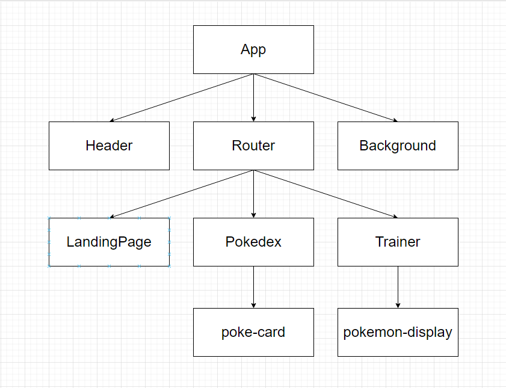

# Noroff Javascript Assignment 3 - Pokemon Trainer
The assignment is to build a Front-end application using angular for a simple pokémon game allowing users to collect pokémon from the pokedex. Also part of the assignment is using a JavaScript-API to persist users and their pokémon.
## Built with
### JavaScript and Angular
The language used in the assignment is primarily JavaScript with the framework Angular. Additionally html and css is used to form the page.
## Architecture 
The components created in this application, are created based on if they are either re-used multiple times, or it makes logical sense to divide the code.
<p align="center">
  
</p>

The components in this application is:
<ul>
<li>App</li>
<li>Header</li>
<li>Router</li>
<li>Background</li>
<li>LandingPage</li>
<li>Pokedex</li>
<li>Trainer</li>
<li>Poke-card</li>
<li>pokemon-display</li>
</ul>

## Running
To run the project clone the git repo,add a environment.ts file with the following object:
```javaScript
export const environment = {
   apiKey: "",
   apiUrl: "",
   pokeApiUrl:""
};
```
and run:

```bash
  npm install
  npm start
  ```
 to install dependencies and start a development version of the application.
 
### Deployment
Clone the project to the deployment server with nginx installed, run
```bash
npm install
npm run build
```
to install dependencies, and build the project. Then point the nginx config to the build-folder of the project.